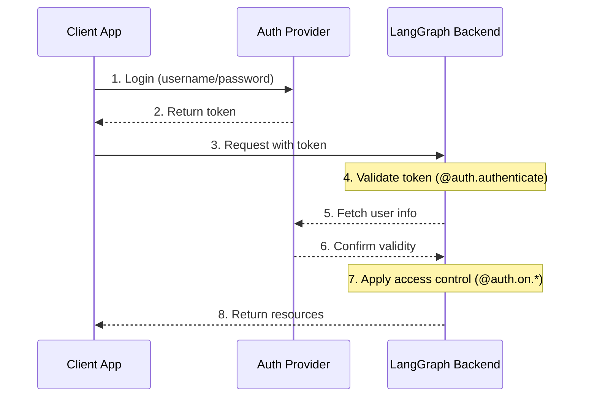

## System Architecture

A typical authentication setup involves three main components:

1. **Authentication Provider** (Identity Provider/IdP)

   - A dedicated service that manages user identities and credentials
   - Handles user registration, login, password resets, etc.
   - Issues tokens (JWT, session tokens, etc.) after successful authentication
   - Examples: Auth0, Supabase Auth, Okta, or your own auth server

2. **LangGraph Backend** (Resource Server)

   - Your LangGraph application that contains business logic and protected resources
   - Validates tokens with the auth provider
   - Enforces access control based on user identity and permissions
   - Doesn't store user credentials directly

3. **Client Application** (Frontend)

   - Web app, mobile app, or API client
   - Collects time-sensitive user credentials and sends to auth provider
   - Receives tokens from auth provider
   - Includes these tokens in requests to LangGraph backend

Here's how these components typically interact:

:::python
Your [`@auth.authenticate`](../cloud/reference/sdk/python_sdk_ref.md#langgraph_sdk.auth.Auth.authenticate) handler in LangGraph handles steps 4-6, while your [`@auth.on`](../cloud/reference/sdk/python_sdk_ref.md#langgraph_sdk.auth.Auth.on) handlers implement step 7.
:::

:::js
Your [`auth.authenticate`](https://langchain-ai.github.io/langgraph/cloud/reference/sdk/js_ts_sdk_ref/#authenticate) handler in LangGraph handles steps 4-6, while your [`auth.on`](https://langchain-ai.github.io/langgraph/cloud/reference/sdk/js_ts_sdk_ref/#on>) handlers implement step 7.
:::

### Source References

- [`handle`](https://github.com/langchain-ai/langgraph/blob/8ccead9560f6/libs/cli/langgraph_cli/exec.py#L135) (function in cli)
- [`Handler`](https://github.com/langchain-ai/langgraph/blob/8ccead9560f6/libs/prebuilt/tests/test_react_agent.py#L446) (class in prebuilt)
- [`handler`](https://github.com/langchain-ai/langgraph/blob/8ccead9560f6/libs/sdk-py/tests/test_client_stream.py#L234) (function in sdk-py)
- [`rc`](https://github.com/langchain-ai/langgraph/blob/8ccead9560f6/libs/sdk-py/tests/test_serde_schema.py#L12) (function in sdk-py)
- [`Send`](https://github.com/langchain-ai/langgraph/blob/8ccead9560f6/libs/langgraph/langgraph/types.py#L285) (class in langgraph)
- [`on`](https://github.com/langchain-ai/langgraph/blob/8ccead9560f6/libs/sdk-py/langgraph_sdk/auth/types.py#L931) (class in sdk-py)
- [`identity`](https://github.com/langchain-ai/langgraph/blob/8ccead9560f6/libs/sdk-py/langgraph_sdk/auth/types.py#L262) (function in sdk-py)
- [`permissions`](https://github.com/langchain-ai/langgraph/blob/8ccead9560f6/libs/sdk-py/langgraph_sdk/auth/types.py#L266) (function in sdk-py)
- [`store`](https://github.com/langchain-ai/langgraph/blob/8ccead9560f6/libs/checkpoint-postgres/tests/test_store.py#L34) (function in checkpoint-postgres)
- [`Auth`](https://github.com/langchain-ai/langgraph/blob/8ccead9560f6/libs/sdk-py/langgraph_sdk/auth/__init__.py#L13) (class in sdk-py)
