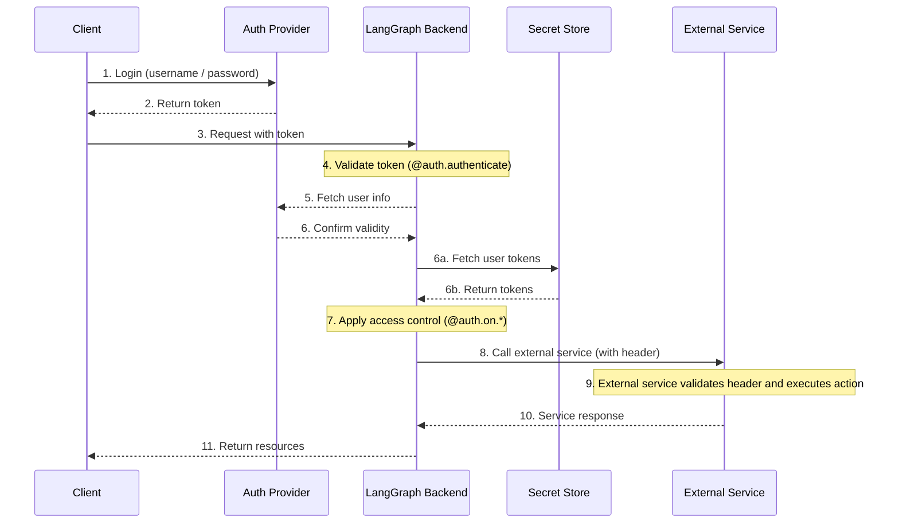

## Agent authentication

Custom authentication permits delegated access. The values you return in `@auth.authenticate` are added to the run context, giving agents user-scoped credentials lets them access resources on the user’s behalf.

After authentication, the platform creates a special configuration object that is passed to your graph and all nodes via the configurable context.
This object contains information about the current user, including any custom fields you return from your [`@auth.authenticate`](../cloud/reference/sdk/python_sdk_ref.md#langgraph_sdk.auth.Auth.authenticate) handler.

To enable an agent to act on behalf of the user, use [custom authentication middleware](../how-tos/auth/custom_auth.md). This will allow the agent to interact with external systems like MCP servers, external databases, and even other agents on behalf of the user.

For more information, see the [Use custom auth](../how-tos/auth/custom_auth.md#enable-agent-authentication) guide.

### Source References

- [`Config`](https://github.com/langchain-ai/langgraph/blob/8ccead9560f6/libs/cli/langgraph_cli/schemas.py#L528) (class in cli)
- [`add`](https://github.com/langchain-ai/langgraph/blob/8ccead9560f6/libs/langgraph/tests/test_pregel.py#L6331) (function in langgraph)
- [`Context`](https://github.com/langchain-ai/langgraph/blob/8ccead9560f6/libs/langgraph/tests/test_pregel.py#L1757) (class in langgraph)
- [`handle`](https://github.com/langchain-ai/langgraph/blob/8ccead9560f6/libs/cli/langgraph_cli/exec.py#L135) (function in cli)
- [`Handler`](https://github.com/langchain-ai/langgraph/blob/8ccead9560f6/libs/prebuilt/tests/test_react_agent.py#L446) (class in prebuilt)
- [`handler`](https://github.com/langchain-ai/langgraph/blob/8ccead9560f6/libs/sdk-py/tests/test_client_stream.py#L234) (function in sdk-py)
- [`execute`](https://github.com/langchain-ai/langgraph/blob/8ccead9560f6/libs/prebuilt/langgraph/prebuilt/tool_node.py#L1174) (function in prebuilt)
- [`rc`](https://github.com/langchain-ai/langgraph/blob/8ccead9560f6/libs/sdk-py/tests/test_serde_schema.py#L12) (function in sdk-py)
- [`create`](https://github.com/langchain-ai/langgraph/blob/8ccead9560f6/libs/sdk-py/langgraph_sdk/auth/types.py#L1039) (class in sdk-py)
- [`Run`](https://github.com/langchain-ai/langgraph/blob/8ccead9560f6/libs/sdk-py/langgraph_sdk/schema.py#L327) (class in sdk-py)
