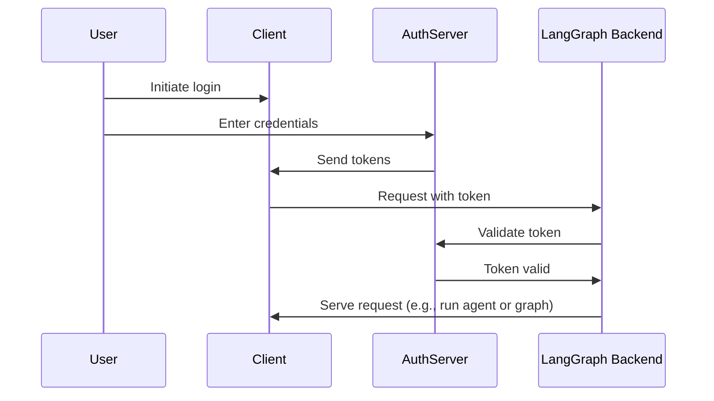

## Background

OAuth2 involves three main roles:

1. **Authorization server**: The identity provider (e.g., Supabase, Auth0, Google) that handles user authentication and issues tokens
2. **Application backend**: Your LangGraph application. This validates tokens and serves protected resources (conversation data)
3. **Client application**: The web or mobile app where users interact with your service

A standard OAuth2 flow works something like this:

### Source References

- [`handle`](https://github.com/langchain-ai/langgraph/blob/8ccead9560f6/libs/cli/langgraph_cli/exec.py#L135) (function in cli)
- [`rc`](https://github.com/langchain-ai/langgraph/blob/8ccead9560f6/libs/sdk-py/tests/test_serde_schema.py#L12) (function in sdk-py)
- [`Run`](https://github.com/langchain-ai/langgraph/blob/8ccead9560f6/libs/sdk-py/langgraph_sdk/schema.py#L327) (class in sdk-py)
- [`Send`](https://github.com/langchain-ai/langgraph/blob/8ccead9560f6/libs/langgraph/langgraph/types.py#L285) (class in langgraph)
- [`on`](https://github.com/langchain-ai/langgraph/blob/8ccead9560f6/libs/sdk-py/langgraph_sdk/auth/types.py#L931) (class in sdk-py)
- [`identity`](https://github.com/langchain-ai/langgraph/blob/8ccead9560f6/libs/sdk-py/langgraph_sdk/auth/types.py#L262) (function in sdk-py)
- [`Auth`](https://github.com/langchain-ai/langgraph/blob/8ccead9560f6/libs/sdk-py/langgraph_sdk/auth/__init__.py#L13) (class in sdk-py)
- [`something`](https://github.com/langchain-ai/langgraph/blob/8ccead9560f6/libs/checkpoint/tests/test_jsonplus.py#L71) (function in checkpoint)
- [`main`](https://github.com/langchain-ai/langgraph/blob/8ccead9560f6/libs/langgraph/tests/test_pregel.py#L6527) (function in langgraph)
- [`graph`](https://github.com/langchain-ai/langgraph/blob/8ccead9560f6/libs/langgraph/tests/test_pregel.py#L5995) (function in langgraph)
